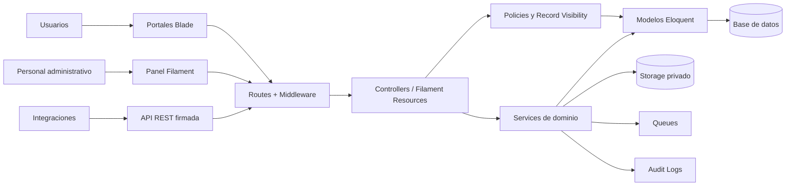
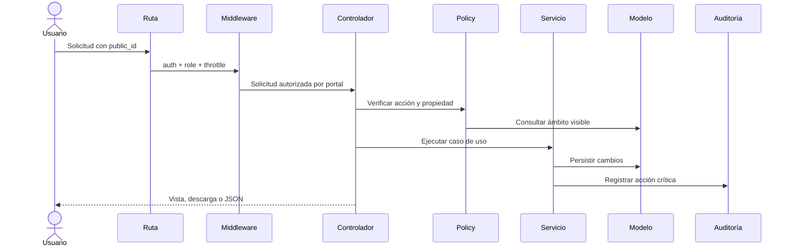
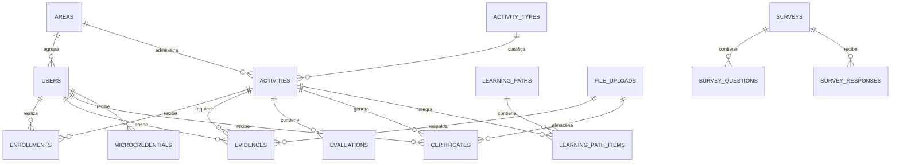

# Plataforma Institucional de Formación, Evidencias y Microcredenciales

Aplicación web institucional para administrar formación interna y externa, rutas de aprendizaje, inscripciones, evidencias, evaluaciones, encuestas, constancias, microcredenciales, webinars, recursos digitales, pagos y reportes de auditoría.

El proyecto está construido como un **monolito modular con Laravel y Filament**. Laravel concentra las reglas de negocio, seguridad, portales y API; Filament proporciona el panel administrativo organizado por áreas funcionales.

## Contenido

- [Objetivo](#objetivo)
- [Estado actual](#estado-actual)
- [Stack tecnológico](#stack-tecnológico)
- [Arquitectura](#arquitectura)
- [Módulos funcionales](#módulos-funcionales)
- [Roles y portales](#roles-y-portales)
- [Panel administrativo Filament](#panel-administrativo-filament)
- [Seguridad](#seguridad)
- [Estructura del proyecto](#estructura-del-proyecto)
- [Requisitos](#requisitos)
- [Instalación](#instalación)
- [Ejecución](#ejecución)
- [Pruebas y calidad](#pruebas-y-calidad)
- [Comandos frecuentes](#comandos-frecuentes)
- [Despliegue](#despliegue)
- [Pendientes](#pendientes)

## Objetivo

Centralizar la gestión del ciclo completo de formación institucional:

1. Publicación de cursos, talleres, minicursos, diplomados, certificaciones y competencias.
2. Solicitud, aprobación y seguimiento de inscripciones.
3. Construcción de rutas de aprendizaje.
4. Registro de asistencia, evaluaciones y encuestas.
5. Carga y validación de evidencias documentales.
6. Emisión y validación pública de constancias.
7. Generación de microcredenciales.
8. Administración de oferta externa, participantes y pagos.
9. Consulta de indicadores para Recursos Humanos, Calidad Académica y responsables de área.
10. Auditoría de acciones críticas.

## Estado actual

La base funcional y de seguridad incluye:

- Autenticación local.
- Inicio de sesión con Google y Microsoft mediante Laravel Socialite.
- Registro externo obligatorio mediante una cuenta personal `@gmail.com`.
- Roles con `spatie/laravel-permission`.
- Portales separados por perfil institucional.
- Panel administrativo construido con Filament.
- Catálogo de actividades y rutas de aprendizaje.
- Inscripciones, asistencias, evidencias y revisiones.
- Evaluaciones, resultados, encuestas y respuestas.
- Constancias, plantillas y microcredenciales.
- Webinars, recursos digitales y pagos.
- Reportes institucionales básicos.
- Auditoría de acciones críticas.
- Archivos privados con descargas autorizadas y URLs firmadas.
- Identificadores ULID públicos para evitar exponer IDs incrementales.
- API firmada de consulta de microcredenciales.
- Rate limiting, Policies y restricciones de acceso por registro.

Las integraciones con OAuth, MFA, Azure Blob Storage, proveedores externos de microcredenciales y antivirus de archivos están preparadas como evolución futura, pero no forman parte de la implementación actual.

## Stack tecnológico

| Componente | Tecnología |
| --- | --- |
| Backend | PHP 8.3+ y Laravel 13 |
| Panel administrativo | Filament 5 |
| Roles y permisos | Spatie Laravel Permission 8 |
| Frontend de portales | Blade, Tailwind CSS 4 y Vite 8 |
| Base de datos | MySQL en operación o SQLite para desarrollo/pruebas |
| ORM | Eloquent |
| Autenticación | Sesión web de Laravel y OAuth con Google/Microsoft |
| Archivos | Laravel Filesystem, almacenamiento privado local y preparación S3 |
| API | REST JSON con URLs firmadas |
| Colas | Laravel Queues |
| Pruebas | PHPUnit 12 |
| Formato PHP | Laravel Pint |

## Arquitectura

### Enfoque general

El sistema utiliza una arquitectura de **monolito modular**:

- Una sola aplicación Laravel.
- Una sola base de datos relacional.
- Módulos separados por responsabilidad funcional.
- Portales y rutas independientes por rol.
- Servicios para reglas de negocio.
- Policies y scopes para autorización por registro.
- Filament como interfaz administrativa.

Este enfoque reduce la complejidad operativa inicial sin mezclar las responsabilidades internas. Los módulos pueden evolucionar posteriormente hacia APIs o servicios independientes si la escala lo requiere.



### Capas principales

#### Presentación

- Vistas Blade para los portales de participantes y personal.
- Resources, Pages, Clusters y Widgets de Filament para administración.
- Respuestas JSON para endpoints API.

#### Enrutamiento y middleware

- Rutas separadas por portal en `routes/`.
- Middleware `auth`, `role`, `signed` y `throttle`.
- Headers de seguridad aplicados globalmente.
- Route model binding mediante `public_id`.

#### Aplicación

- Controladores HTTP coordinan solicitudes y respuestas.
- Form Requests autorizan y validan entradas.
- Services ejecutan casos de uso y reglas de negocio.
- Auditoría registra operaciones críticas sin interrumpir el flujo principal.

#### Dominio y datos

- Modelos Eloquent representan las entidades institucionales.
- Policies validan roles, propiedad, área, tipo de oferta y asignaciones.
- El scope `visibleTo()` limita consultas al ámbito del usuario.
- Las llaves `id` se conservan para relaciones internas.
- Los ULID `public_id` se utilizan en URLs y exposiciones externas.

#### Infraestructura

- Base de datos MySQL o SQLite.
- Storage privado en `storage/app/private`.
- Laravel Queues para tareas asíncronas.
- Vite para compilar CSS, fuentes y JavaScript.

### Flujo de una solicitud protegida



### Modelo funcional



## Módulos funcionales

### Administración del sistema

- Usuarios internos y externos.
- Áreas institucionales.
- Roles y perfiles.
- Estado de cuentas.
- Logs de notificaciones.

### Gestión académica

- Tipos de actividad.
- Actividades formativas.
- Personal docente, administrativo y responsables.
- Inscripciones.
- Asistencias.
- Rutas de aprendizaje y sus actividades.

### Evidencias y evaluación

- Carga de evidencias.
- Asignación de evaluadores.
- Validación o rechazo.
- Historial de revisiones.
- Evaluaciones y resultados.
- Encuestas, preguntas y respuestas.
- Archivos relacionados.

### Constancias y microcredenciales

- Plantillas de constancia.
- Emisión y seguimiento de constancias.
- Validación pública mediante folio.
- Descarga privada autorizada.
- Generación de payloads de microcredenciales.
- Consulta API por `public_id`.

### Educación continua

- Oferta dirigida a participantes externos.
- Participantes externos.
- Inscripciones externas.
- Pagos y comprobantes.
- Webinars.
- Recursos digitales.

### Calidad y auditoría

- Consulta de evidencias institucionales.
- Evaluaciones y resultados.
- Reportes de calidad.
- Preparación para indicadores CACEI, ABET e ISO.
- Bitácora de auditoría.

## Roles y portales

| Rol | Portal o responsabilidad |
| --- | --- |
| `Superadministrador` | Acceso administrativo global |
| `Recursos Humanos` | Formación interna, personal, evidencias, constancias y reportes |
| `Calidad Academica` | Evidencias, evaluaciones, auditoría y reportes de calidad |
| `Educacion Continua` | Oferta externa, participantes, pagos y constancias externas |
| `Personal` | Actividades asignadas, participantes, asistencia, evidencias y evaluaciones |
| `Evaluador` | Evidencias y evaluaciones expresamente asignadas |
| `Responsable Area` | Registros e indicadores de su propia área |
| `Profesor` | Portal de participante |
| `Alumno` | Portal de participante |
| `Externo` | Portal de participante externo |

Las rutas están separadas en:

- `routes/participant.php`
- `routes/personal.php`
- `routes/evaluator.php`
- `routes/rh.php`
- `routes/quality.php`
- `routes/continuing-education.php`
- `routes/area-manager.php`
- `routes/public.php`
- `routes/api.php`

La separación de rutas no sustituye la autorización de backend: cada operación sensible también utiliza Policies y filtros de visibilidad.

## Panel administrativo Filament

El panel administrativo utiliza **Filament 5** y está disponible en:

```text
/admin
```

Su configuración principal se encuentra en:

```text
app/Providers/Filament/AdminPanelProvider.php
```

Los recursos están agrupados en Clusters:

| Cluster | Propósito |
| --- | --- |
| `SystemAdministration` | Usuarios, áreas y administración general |
| `AcademicManagement` | Actividades, tipos, rutas, inscripciones y asistencia |
| `EvidenceManagement` | Evidencias, evaluaciones, encuestas y archivos |
| `CredentialManagement` | Constancias, plantillas y microcredenciales |
| `ContinuingEducation` | Pagos, webinars y recursos digitales |
| `QualityManagement` | Auditoría y calidad |

Filament aplica las siguientes restricciones:

- `User::canAccessPanel()` exige una cuenta activa y un rol administrativo permitido.
- Los Resources utilizan Policies.
- Las consultas se limitan mediante `visibleTo()`.
- Los selectores relacionales también respetan el ámbito del usuario.
- Los Resources sin Policy fallan cerrados y sólo son visibles para Superadministración.
- El borrado físico está deshabilitado desde el Resource base.
- Archivos, auditoría y respuestas sensibles son de sólo lectura.
- CURP y payloads externos no aparecen en listados generales.

## Seguridad

### Identificadores públicos

Los modelos expuestos en rutas utilizan ULID en `public_id`. Los IDs incrementales permanecen únicamente para relaciones internas.

Ejemplo:

```text
/participant/catalog/01JZ...
```

No se utiliza:

```text
/participant/catalog/15
```

### Autorización

La autorización combina:

- Middleware por rol.
- Policies por modelo.
- Validación de propiedad.
- Restricción por área.
- Separación de oferta interna y externa.
- Asignación explícita de personal responsable o evaluador.
- Scopes `visibleTo()` en consultas y Filament.

### Archivos privados

- El disco `local` apunta a `storage/app/private`.
- Los paths físicos no se muestran al usuario.
- Las descargas requieren autenticación, URL firmada, Policy y rate limit.
- Antes de responder se verifica que el archivo exista.
- La descarga se registra en auditoría.

### Constancias públicas

La ruta:

```text
/certificates/verify/{folio}
```

únicamente muestra estado, nombre, actividad, tipo, fecha, folio e institución emisora. No expone CURP, email, evidencias, resultados ni archivos privados.

### Controles adicionales

- Rate limiting en login, descargas, API, validación pública y portales.
- Headers contra MIME sniffing y framing.
- Cookies `HttpOnly` y configuración `SameSite`.
- Validación mediante Form Requests.
- Restricciones de tipo MIME y tamaño de archivo.
- Auditoría con redacción de datos sensibles.
- API de microcredenciales con URL firmada.
- CSRF activo en rutas web.

La documentación específica está en `docs/security.md`.

## Estructura del proyecto

```text
app/
├── Filament/
│   ├── Clusters/              # Agrupación funcional del panel
│   └── Resources/             # CRUD y vistas administrativas
├── Http/
│   ├── Controllers/           # Controladores por portal y API
│   ├── Middleware/            # Headers y controles HTTP
│   └── Requests/              # Autorización y validación de entradas
├── Models/
│   └── Concerns/              # ULID público y scopes de visibilidad
├── Policies/                  # Autorización por modelo y registro
├── Providers/                 # Laravel, rate limits y panel Filament
└── Services/
    ├── Audit/
    ├── Catalog/
    ├── Certificates/
    ├── Enrollments/
    ├── Evaluations/
    ├── Evidences/
    ├── LearningPaths/
    ├── Microcredentials/
    ├── Reports/
    ├── Security/
    └── Surveys/

database/
├── migrations/                # Esquema y evolución de base de datos
└── seeders/                   # Roles, áreas, catálogos y usuario inicial

resources/views/
├── participant/
├── personal/
├── evaluator/
├── rh/
├── quality/
├── continuing-education/
├── area-manager/
└── public/

routes/
├── web.php
├── auth.php
├── api.php
└── [portal].php

tests/
├── Feature/
└── Unit/
```

## Requisitos

- PHP `8.3` o superior.
- Composer `2`.
- Node.js `^20.19.0` o `>=22.12.0`.
- npm.
- MySQL 8+ o SQLite.
- Extensiones PHP habituales de Laravel:
  - `ctype`
  - `fileinfo`
  - `mbstring`
  - `openssl`
  - `pdo`
  - `tokenizer`
  - `xml`
  - `pdo_mysql` para MySQL
  - `pdo_sqlite` y `sqlite3` para SQLite y pruebas

## Instalación

### 1. Clonar y entrar al proyecto

```bash
git clone <URL_DEL_REPOSITORIO>
cd plataforma-formacion
```

### 2. Instalar dependencias PHP

```bash
composer install
```

### 3. Crear el archivo de entorno

En Linux o macOS:

```bash
cp .env.example .env
```

En PowerShell:

```powershell
Copy-Item .env.example .env
```

### 4. Generar la llave de la aplicación

```bash
php artisan key:generate
```

### 5. Configurar la base de datos

#### Opción A: SQLite

Crear el archivo:

Linux o macOS:

```bash
touch database/database.sqlite
```

PowerShell:

```powershell
New-Item database/database.sqlite -ItemType File -Force
```

Configurar `.env`:

```dotenv
DB_CONNECTION=sqlite
```

PHP debe tener habilitadas las extensiones `pdo_sqlite` y `sqlite3`.

#### Opción B: MySQL

Crear una base de datos y configurar `.env`:

```dotenv
DB_CONNECTION=mysql
DB_HOST=127.0.0.1
DB_PORT=3306
DB_DATABASE=plataforma_formacion
DB_USERNAME=root
DB_PASSWORD=
```

### 6. Ejecutar migraciones y seeders

```bash
php artisan migrate --seed
```

Los seeders crean:

- Roles institucionales.
- Áreas iniciales.
- Tipos de actividad.
- Encuesta general de satisfacción.
- Usuario de administración para desarrollo.

Credenciales iniciales de desarrollo:

```text
Correo: test@example.com
Contraseña: password
```

Estas credenciales deben cambiarse o eliminarse antes de publicar el sistema.

### 7. Instalar dependencias frontend

```bash
npm install
```

### 8. Compilar frontend

Para desarrollo:

```bash
npm run dev
```

Para producción:

```bash
npm run build
```

### Instalación rápida

El proyecto también incluye:

```bash
composer run setup
```

Este comando instala dependencias, crea `.env`, genera la llave, ejecuta migraciones e instala/compila frontend. Después se recomienda ejecutar:

```bash
php artisan db:seed
```

Si se utiliza SQLite, el archivo `database/database.sqlite` debe existir antes de ejecutar el setup.

## Ejecución

### Opción simple

En una terminal:

```bash
php artisan serve
```

En otra terminal:

```bash
npm run dev
```

La aplicación estará disponible normalmente en:

```text
http://127.0.0.1:8000
```

Panel Filament:

```text
http://127.0.0.1:8000/admin
```

### Opción con todos los procesos

```bash
composer run dev
```

Este comando inicia:

- Servidor Laravel.
- Worker de colas.
- Visor de logs con Pail.
- Vite.

### Worker de colas independiente

```bash
php artisan queue:work
```

## Configuración relevante

Variables principales:

```dotenv
APP_NAME="Plataforma Institucional de Formación"
APP_ENV=local
APP_DEBUG=true
APP_URL=http://localhost
APP_TIMEZONE=America/Mexico_City

SESSION_SECURE_COOKIE=false
SESSION_HTTP_ONLY=true
SESSION_SAME_SITE=lax

FILESYSTEM_DISK=local
QUEUE_CONNECTION=database

SECURITY_UPLOAD_MAX_KB=10240
SECURITY_SIGNED_URL_MINUTES=10
```

Para producción:

```dotenv
APP_ENV=production
APP_DEBUG=false
SESSION_SECURE_COOKIE=true
```

### Configuración de Google OAuth

Crear un cliente OAuth 2.0 de tipo aplicación web en Google Cloud Console y registrar como URI de redirección:

```text
http://127.0.0.1:8000/auth/google/callback
```

En producción debe utilizarse la URL HTTPS real. Configurar:

```dotenv
GOOGLE_CLIENT_ID=
GOOGLE_CLIENT_SECRET=
GOOGLE_REDIRECT_URI="${APP_URL}/auth/google/callback"
```

El registro de participantes externos:

- Sólo utiliza Google.
- Exige un correo verificado terminado en `@gmail.com`.
- Rechaza cuentas institucionales y Google Workspace.
- Asigna automáticamente `user_type=externo`, `profile_type=externo` y rol `Externo`.

### Configuración de Microsoft OAuth

Registrar una aplicación web en Microsoft Entra ID con la URI:

```text
http://127.0.0.1:8000/auth/microsoft/callback
```

Configurar:

```dotenv
MICROSOFT_CLIENT_ID=
MICROSOFT_CLIENT_SECRET=
MICROSOFT_REDIRECT_URI="${APP_URL}/auth/microsoft/callback"
MICROSOFT_TENANT_ID=organizations
```

`organizations` limita el acceso a cuentas de trabajo o escuela. Para restringir el sistema a una sola institución, sustituirlo por el ID del tenant de Microsoft Entra.

Microsoft y Google no crean cuentas institucionales automáticamente: sólo permiten entrar a usuarios previamente registrados y vinculan el identificador del proveedor después de validar el correo.

## Pruebas y calidad

### Suite completa

```bash
php artisan test
```

En el entorno Windows utilizado durante el desarrollo, el PHP CLI no carga SQLite por defecto. La suite puede ejecutarse explícitamente con:

```powershell
php -d extension=php_pdo_sqlite.dll -d extension=php_sqlite3.dll vendor\bin\phpunit
```

Para corregirlo permanentemente, habilitar en el `php.ini` del PHP CLI:

```ini
extension=php_pdo_sqlite.dll
extension=php_sqlite3.dll
```

### Formato PHP

Validar:

```bash
vendor/bin/pint --test
```

Corregir:

```bash
vendor/bin/pint
```

### Compilación frontend

```bash
npm run build
```

### Cobertura funcional de seguridad

Las pruebas incluyen:

- Acceso de usuarios no autenticados.
- ULID en rutas sensibles.
- Prevención de acceso a constancias y evidencias ajenas.
- Restricción de cursos por personal responsable.
- Restricción de evidencias por evaluador asignado.
- Acceso a Filament por rol.
- Protección de datos en constancias públicas.
- Descargas privadas con firma y Policy.
- API firmada sin IDs internos.

Estado verificado:

```text
14 pruebas
38 aserciones
```

## Comandos frecuentes

```bash
# Ver rutas
php artisan route:list

# Ejecutar migraciones
php artisan migrate

# Recrear base de desarrollo
php artisan migrate:fresh --seed

# Limpiar cachés
php artisan optimize:clear

# Crear cachés para producción
php artisan optimize

# Ejecutar colas
php artisan queue:work

# Ver logs
php artisan pail

# Abrir consola
php artisan tinker

# Compilar frontend
npm run build
```

## Despliegue

Lista mínima para producción:

1. Configurar PHP, servidor web y MySQL.
2. Configurar `.env` sin subirlo al repositorio.
3. Usar `APP_ENV=production`.
4. Usar `APP_DEBUG=false`.
5. Configurar HTTPS.
6. Usar `SESSION_SECURE_COOKIE=true`.
7. Instalar dependencias optimizadas:

```bash
composer install --no-dev --optimize-autoloader
npm ci
npm run build
```

8. Ejecutar:

```bash
php artisan migrate --force
php artisan optimize
```

9. Configurar un worker permanente para colas.
10. Dar permisos de escritura únicamente a `storage/` y `bootstrap/cache/`.
11. Mantener documentos sensibles fuera de `public/`.
12. Configurar respaldos de base de datos y archivos.
13. Cambiar las credenciales iniciales.
14. Revisar `docs/security.md`.

Ejemplo de worker:

```bash
php artisan queue:work --sleep=3 --tries=3
```

En producción se recomienda administrar el worker con Supervisor, systemd o el servicio equivalente.

## Pendientes

- Verificación de correo.
- MFA.
- Recuperación de contraseña reforzada.
- Integración con Azure Blob Storage o S3 institucional.
- Escaneo antivirus de archivos.
- Generación completa de PDF y QR para constancias.
- Firma criptográfica de microcredenciales.
- Envío a proveedores externos mediante queues.
- Reportes avanzados CACEI, ABET e ISO.
- Exportación institucional a Excel y PDF.
- Notificaciones por correo.
- Políticas de retención y cifrado de campos sensibles.

## Documentación adicional

- Seguridad: `docs/security.md`
- Rutas: `php artisan route:list`
- Esquema: `database/migrations/`
- Roles iniciales: `database/seeders/RoleSeeder.php`
- Configuración Filament: `app/Providers/Filament/AdminPanelProvider.php`
